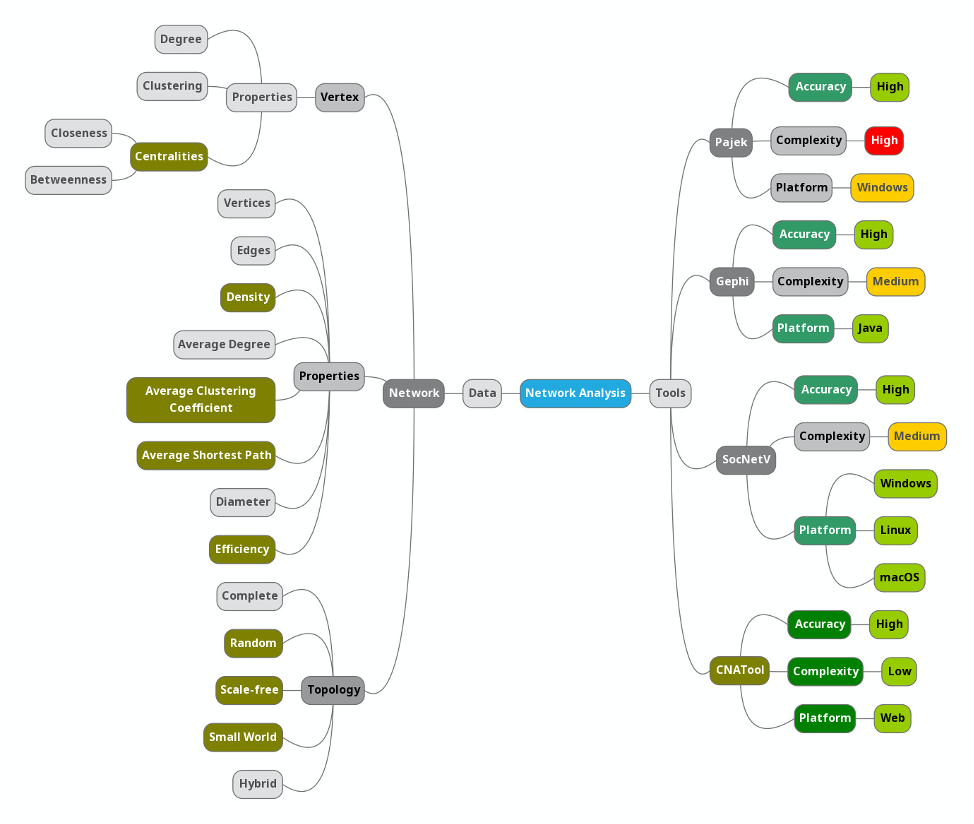
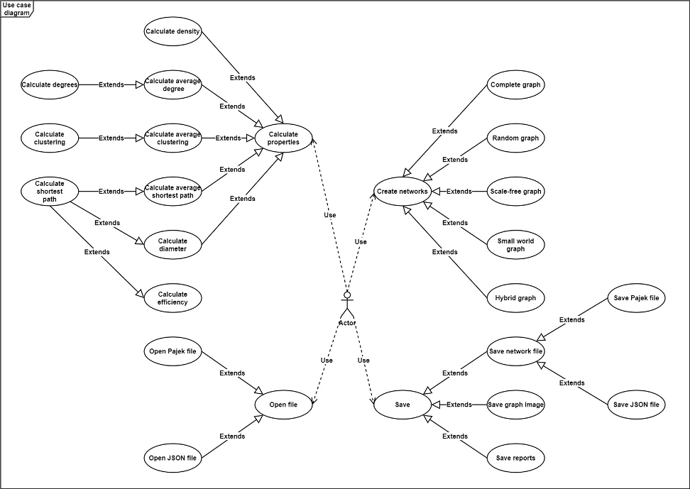
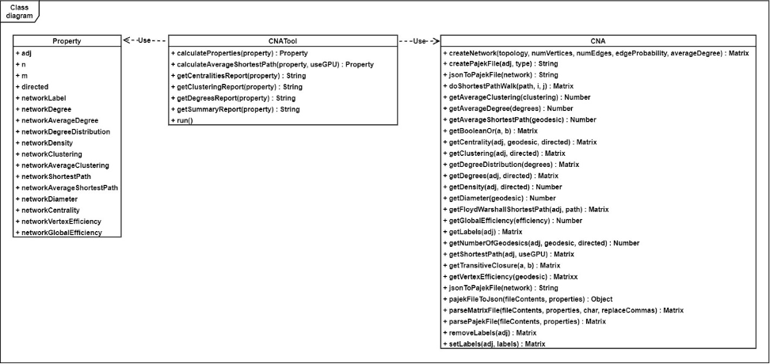
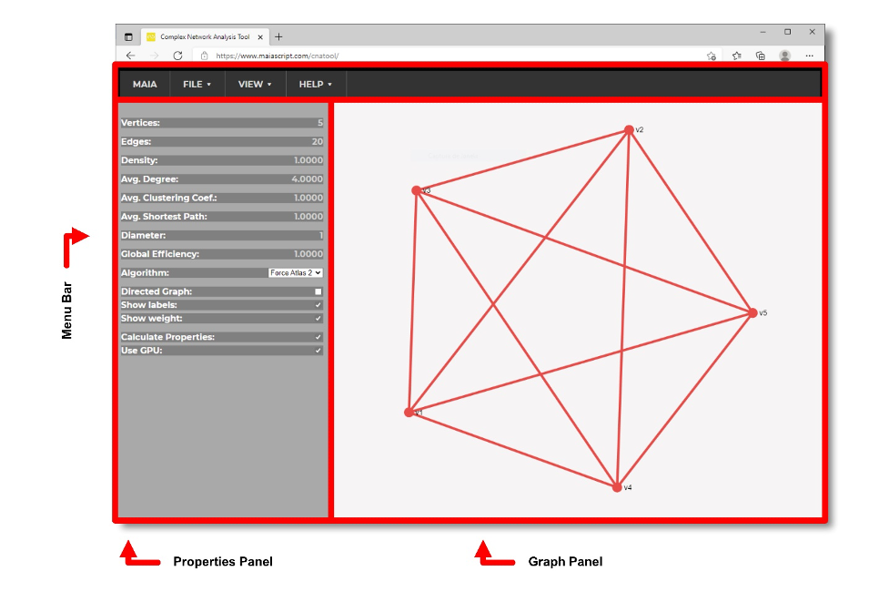
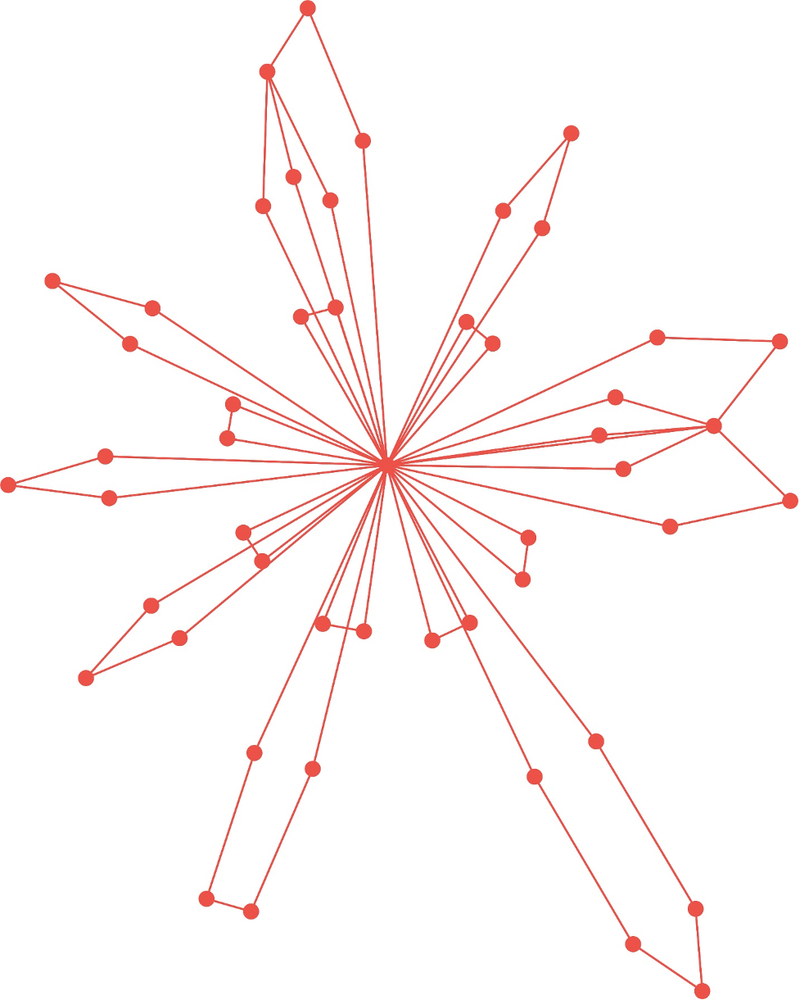

# Summary

CNATool is an online program for analyzing complex and social networks. It was developed to allow quick and simplified analysis of network graphs from any device connected to the Internet. It supports graphs in Pajek and JSON formats, creates graphs of artificial networks, displays graphs, selects the layout algorithm and displays its properties (average degree, density, average clustering coefficient, average shortest path, diameter and efficiency). It also displays detailed properties of the vertices and saves the graph in Pajek, JSON and SVG formats, in addition to generating HTML reports.

# Introduction

The analysis of complex networks has become frequent, considering that many social, biological and technological phenomena can be represented as network diagrams (also known as Graphs), allowing not only a visual analysis of the problem, but the use of tools developed for a given application involving graph theory [@Newman2003], in solving problems different from those originally thought. @Pereira2007, in their study on LPAs (local productive arrangements), used networks theory to study the processes of cooperation and collaboration between companies that make up an LPA of confections by analyzing the data using the Pajek software [@Moody2005; @Prieto2008]. @Vieira2016 studied collaboration processes between researchers at an important research institute, using similar techniques applying Gephi software in their analysis, also used by @Casteigts2012 in their research on time-varying networks (TVGs). @Monteiro2014 proposed a model appropriate to explain evolution of species in an affinity network, based on an evolutive algorithm that incorporates the same network properties. @Pereira2019, analyzed the stock exchanges for 20 countries in a multiscale network identifying the linkages between markets. @Zhou2019 used complex network theory to monitor coupled risks. @Zhu2021 applied centrality calculations to study the functional architecture of healthy individuals trying to determine their regulatory mechanism. @Chang2021 studied the deterioration of associative memory in individuals with mild amnesia, analyzing semantic clusters. @Li2019 analyzed the effect of centrality of directors on social network in charitable donations. @Guo2020 showed how the Chinese construction industry applies complex network analysis to study accident risks. @Zhang2021 proposed a model of public opinion diffusion in social networks applying the theory of scale-free networks. @Krajewski2022 studied the effect of centrality in collaborative networks among criminal members of the Italian-American mafia.

Health studies have also benefited from the use of network theory and its computational tools. @Bullmore2009 studied the structure and functions of the brain using graph theory [@Goulas2015]. Inspired by studies on social networks, they analyzed the neural network of monkey cortex and demonstrated the important role of weak connections in the cohesion of the studied network. @Hilgetag2000 also studied the visual cortex of monkeys and cats using complex network analysis techniques.

These are just some applications involving the use of techniques and software developed for social and complex network analysis. @Watts2004, in its review on the state of the art in complex network analysis presents other applications, highlighting economy, transportation and energy distribution.

It is in this context that we developed the CNATool software, based on the need to perform fast data analysis involving models represented as complex networks from any device connected to the Internet. This need is due to the fact that many ideas arise when we are not in front of a computer to run traditional programs in network analysis. On the other hand, researchers are often involved in the analysis and comparison of multiple networks. Analyzes of this type usually require time to be performed, involving the construction of scripts for batch processing. The tool presented here fulfills not only the need for an online network analysis program, but also the batch processing of an arbitrary number of networks, in a simple and accurate way.

Next, we will present the requirements taken into consideration for the CNATool development, its architecture and implementation.

# Problems and Background 

@Newman2003 presents the main concepts involved in complex and social network analysis. The author discusses the types of networks, topologies, local and global properties. Regarding the types of networks, Newman highlights social, informational, technological and biological networks. These networks, despite having different natures, present common properties such as number of vertices, number of edges, density [@Pereira2016; @Chatterjee2007], average degree, average clustering coefficient [@Schank2005], average shortest path [@Johnson1977], diameter [@Razzaque2008] and efficiency [@Latora2001]. And even at micro scale, similar parameters are observed, highlighting the clustering coefficient and the closeness [@Freeman1978; @Freeman1979] **citacao 28** and betweenness [@Freeman1977; @Brandes2001; @Barthelemy2004; @Curado2022] centralities. With regard to topologies, networks of apparently different natures, such as social and biological, often present phenomena common to small-world [@Watts1998; @Marchiori2000; @Emmert2006; @Bakshy2011] and scale-free networks [@Barabasi2002; @Crucitti2003].

These similarities allow the use of the same software for the analysis of different phenomena in different study objects, as long as these phenomena and objects can be expressed as network diagrams (graphs).

This premise has led us to consolidate the main parameters used by the authors in the mental map presented in Figure 1. In this map we highlight, besides the network properties and topologies found in the literature, the main free software used in the references surveyed. In the mind map, the Tools node presents the software Gephi, Pajek, SocNetV and CNATool (the tool described in this article). For comparison purposes, we have considered the aspects accuracy, complexity of use, operating platform, and computing technology. It is clear from this graph that the three softwares are accurate, differentiating with respect to the complexity of operation, operational platform, and computing technology. In this respect it is important to stress that an increase in complexity does not represent a demerit but stems from a greater number of resources presented by the software. Likewise, a limitation regarding the operating platform does not invalidate its use but is only restricted to users of the operating systems highlighted in the graph. On the other hand, the computing technology used represents a great differential. Applications capable of using the graphics card processing cores (GPU) present superior performance, especially when processing graphs with a large number of vertices and edges. In this research, only CNATool offered this possibility. Moreover, CNATool implements some properties not found in other software, for example incidence-fidelity index [@Teixeira2010]. **Table 1** presents a summary of the main features presented by each of the analyzed programs. \autoref{tb:tb1}

CNATool's development took these aspects into consideration, prioritizing accuracy and speed, but not neglecting parameters such as usability and mobility.


 
| Feature	| CNATool	| Gephi	| Pajek	| SocNetV |
| :---- | ---- | ---- | ---- | ----: |
| Has high accuracy	| Yes	| Yes	| Yes	| Yes |
| Is user-friendly	| Yes	| Yes	| No	| No |
| Runs on Windows	| Yes	| Yes	| Yes	| Yes |
| Runs on Linux	| Yes	| Yes	| No | Yes |
| Runs on macOS	| Yes	| Yes	| No	| Yes |
| Runs on Android	| Yes	| No	| No	| No |
| Runs on iOS	| Yes	| No	| No	| No |
| Runs direct on web	| Yes	| No	| No	| No |
| Calculates Efficiency	| Yes	| No	| No	| No |
| Calculates Incidence-fidelity	| Yes	| No	| No	| No |
| Uses the GPU to speed up calculations	| Yes	| No	| No	| No |
\label{tb:tb1}
Table: Summary of the main features presented by each of the analyzed programs.

# Software Framework 

The mind map presented in \autoref{fig:fig1} allowed to define the requirements for the CNATool application. These requirements were formalized in the use-case diagram illustrated in \autoref{fig:pic2}. This diagram summarizes the minimal functionalities that, based on data presented in the literature, a complex network analysis software should have.



## Software Architecture

The software consists of four elements: front end, CNATool library, CNALib library (Complex Network Analysis Library) and MaiaLib library (MaiaScript Library). The front end was implemented in HTML, CSS, JavaScript and MaiaScript. MaiaScript is a high-level, object-oriented programming language developed specifically for the construction of scientific applications. It has an integrated CAS (Computer Algebra System), capable of performing linear algebra operations, calculations with complex numbers, matrices operations and, through a second CAS, Algebrite, integrated into the MaiaStudio development environment, performs differential and symbolic integral calculations and operations with arbitrary number precision. MaiaScript code embedded in the front end is compiled at runtime and converted to JavaScript. The CNATool library contains high-level functions to facilitate the generation of reports by the application. This library was developed in Javascript.

The CNALib library was completely written in MaiaScript but, unlike the code embedded in the front end, it is precompiled to JavaScript, a necessary requirement due to security restrictions present in most browsers that prevent non-JavaScript code loading through the web page.

## Software Functionalities

Currently, CNATool offers the following features:

- Create artificial networks (e.g., complete graph, random graph, scale free graph, small world grade, hybrid graph and semantic networks (Command Line Interface - CLI only)).
-	Display the network graph.
-	Define the graph layout algorithm.
-	Calculate basic properties of the graph: average degree, density, average clustering coefficient, average shortest path, diameter, efficiency of the graph and incidence-fidelity index (CLI only).
-	Use the GPU, if available, to speed up property calculations.
-	See detailed properties of the vertices: degree, clustering coefficient and closeness and betweenness centralities.
-	Exports CSV file with the incidences fidelities of each pair of semantic network words (CLI only).
-	Save graph in Pajek and JSON format.
-	Export graph in SVG format.
-	Save a summary of the graph's properties in HTML format.

## Sample code snippets analysis

The CNATool supports two network file formats: Pajek and JSON. The Pajek format consists of a human-readable text file, where vertices (id, label and plane coordinates, as well as vertex diameter) and edges (origin vertex, destination vertex and edge weight) are defined.  The following code fragment presents a graph with 3 vertices and 3 edges:

```
*Vertices 3
1 "v1" 1.4938470125198364 0.5946584343910217 1
2 "v2" -1.3428300619125366 0.9276683330535889 1
3 "v3" -0.21226459741592407 -1.7475401163101196 1
*Arcs
1 2 1
1 3 1
2 1 1
2 3 1
3 1 1
3 2 1
```

# Implementation and Empirical Results

The program herein described was developed considering the principle of reusability. Modeling details and empirical results are presented below.

## Implementation

The application was modeled according to the object-oriented paradigm. \autoref{fig:pic3} shows the diagram of the implemented classes and their interdependencies.



The Property class defines graph properties that will be calculated by the CNA class. This class, in turn, returns calculated values for the CNATool class, which uses them to produce the reports made available by the application. The CNATool class also provides methods used by the application when running on the command line, allowing to create graphs with complete, random, scale-free, small world and hybrid topologies, as well as batch files processing. The command line tool calls the run method of this class to process the arguments passed to the application and execute the corresponding methods provided by the CNA class.

The web interface uses these three classes to provide all its functionality, privileging usability without compromising the performance and accuracy required in the analysis of complex and social networks. \autoref{fig:pic4} shows the web interface when running from a desktop browser. In browsers for mobile devices, the web page reorganizes itself and assumes a more appropriate layout for small screens (responsiveness).



## Unit tests

Any computer program is subject to failure due to coding errors in the program itself or in the libraries and frameworks used in its construction. To minimize this problem, it is necessary to carry out exhaustive tests with each new version of the application. In this project we have implemented a set of unit tests that is performed at each change within its source code. These tests were implemented using the automation test engine of the MaiaScript programming language.

The test script executes each of the functions of the CNA library comparing the results obtained with values previously calculated and validated using other network analysis softwares (Gephi, Pajek and SocNetV).

The tests are repeated countless times to eliminate the possibility of sporadic errors.

## Empirical Results

In order to validate the accuracy of the results provided by CNATool, we created the network shown in \autoref{fig:pic5} and calculated its properties using CNATool, Gephi, Pajek and SocNetV tools, the last three being the ones that most appear in the literature.

{ width=70% }

From the results presented in **Table 2**, it can be seen that the precision of the calculations of the four tools is very close. The Pajek application showed better accuracy than the others when calculating density, average clustering coefficient and average shortest path. In relation to the other properties, CNATool, Pajek and SocNetV applications presented the same results. The Gephi tool showed less precision than the others when calculating the density, the average clustering coefficient and the average shortest path. \autoref{tb:tb2}

These differences, however, do not invalidate any of the tools presented, as for most problems involving analysis of complex networks, 3 decimal digits are sufficient
 
| Property	| CNATool	| Gephi	| Pajek	| SocNetV |
| :---- | ---- | ---- | ---- | ----: |
| Vertices	| 50	| 50	| 50	| 50 |
| Edges	| 140	| 140	| 140	| 140 |
| Density	| 0.05710000	| 0.05700000	| 0.05714286	| 0.05710000 |
| Average Degree	| 2.8	| 2.8	| 2.8	| 2.8 |
| Average Clustering Coefficient	| 0.34430000	| 0.34400000	| 0.34431746	| 0.34400000 |
| Average Shortest Path	| 2.45140	| 2.45100	| 2.45143	| 2.45140 |
| Diameter	| 5	| 5	| 5	| 5 |
| Global Efficiency	| 0.4520	| No	| No	| No |
\label{tb:tb2}
Table: Comparison of results obtained using the main complex network analysis software.

# Illustrative Examples

As an illustration of the process of visualizing and calculating properties of a graph using CNATool, we will create a random network with 20 vertices and average degree 2. The steps to accomplish this task are as follows:
1.	Click the Random Graph option.
2.	Enter the number of vertices (20).
3.	Select the desired number of edges (in this case 0, as the network will be created by defining the average degree).
4.	Enter the probability of edge formation (in this case 0, as the network will be created by defining the average degree).
5.	Define the average degree (2).

After performing these steps, the network will be created and displayed on the application screen.

To calculate the properties of the created graph, select the Calculate Properties option in the properties panel.

The created graph presents a random organization of the vertices. To modify this layout, a layout algorithm must be selected in the properties panel. Two algorithms are supported: Force Atlas 2 and No Overlap.

\autoref{fig:pic6} presents the activity diagrams of CNATool's main functionalities.


# Impact

We often encounter problems that can be represented using network diagrams (graphs). These problems may involve the analysis of one, dozens, hundreds or thousands of complex networks. Analyzes of this type require batch processing, which is not always easy to implement using the software most commonly used in this activity. On the other hand, many ideas arise when a researcher is away from a computer with appropriate tools for carrying out concept proofs. In this context, having a software that allows the analysis of social and complex networks from a cell phone or tablet and that still allows subsequent detailed analysis of phenomena observed in a large number of networks easily and quickly, represents great impact. This project seeks to meet these needs, combining ease usage with the accuracy required in this type of investigation. Although installation is not necessary, the download for offline use is available and according to the website [npm-stat](https://npm-stat.com) the CNATool tool has had 5122 downloads since its launch in September 2020. It also has been used by our undergraduate, master's and doctoral students at the State University of Bahia, Federal University of Bahia and SENAI-CIMATEC University Center.

# Conclusions

The CNATool tool was developed having in mind the analysis of complex and social networks from any device connected to the Internet. This application offers a friendly and intuitive user interface, while providing accurate results and detailed reports of global and local network properties being analyzed.

The program allows exporting of results in the most common file formats and also provides a command line tool that allows batch processing, contributing to speed up analysis processes when an experiment requires calculation of properties of a large number of networks.

The project used good software engineering practices, valuing the reusability and maintenance of the code, since it is an open source project and contributions are expected to be made to its development.

The tool presented similar results to the most used applications in complex and social network analysis, having also fulfilled the objective of its project: to offer an easy-to-use software, available from any device connected to the Internet.

# Conflict of Interest 

We wish to confirm that there are no known conflicts of interest associated with this publication and there has been no significant financial support for this work that could have influenced its outcome.

# Acknowledgements 

Fundação de Amparo à Pesquisa do Estado da Bahia, an agency for induction and promotion of research and scientific and technological innovation in the State of Bahia, Grant No. BOL0239/2018 - Renata Souza Freitas Dantas Barreto.


# References
